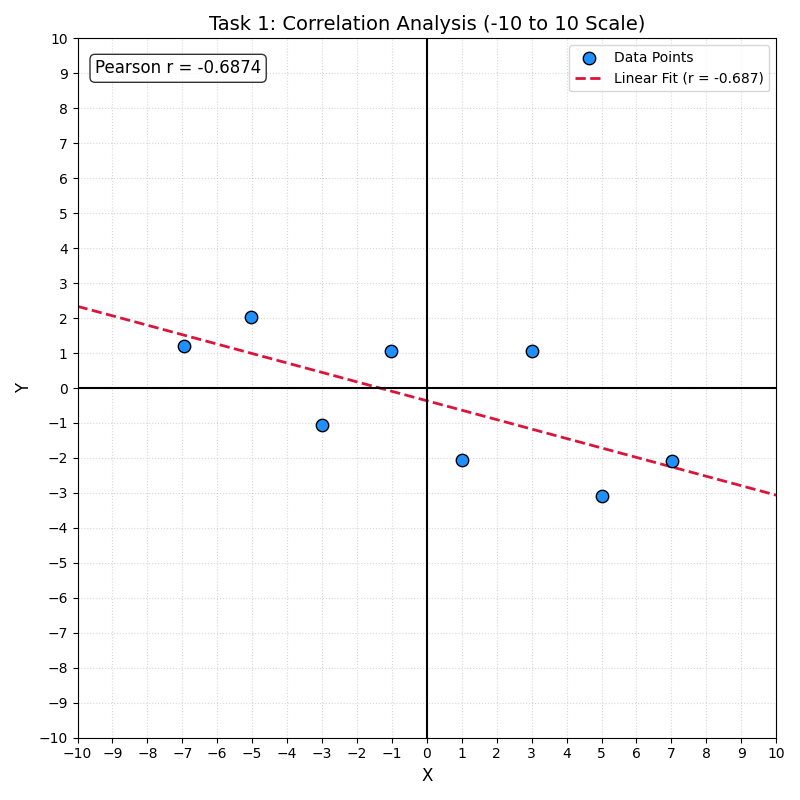
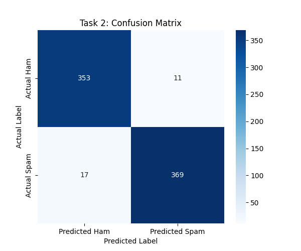

## Task 1: Pearson Correlation Coefficient Analysis

### 1. Introduction
The objective of this task was to analyze the linear relationship between two variables, $X$ and $Y$, using a specific set of 8 data points. The primary metric used for this evaluation is the Pearson Correlation Coefficient ($r$), which measures the strength and direction of the linear relationship between two variables.

### 2. Dataset
The following data points were extracted and utilized for the calculation:

| Point ($i$) | $x_i$ | $y_i$ |
| :--- | :--- | :--- |
| 1 | -6.95 | 1.19 |
| 2 | -5.04 | 2.03 |
| 3 | -3.01 | -1.05 |
| 4 | -1.04 | 1.07 |
| 5 | 1.02 | -2.05 |
| 6 | 3.02 | 1.07 |
| 7 | 5.02 | -3.09 |
| 8 | 7.02 | -2.09 |

### 3. Methodology
The calculation follows the standard Pearson formula:

$$r = \frac{\sum_{i=1}^{n}(x_i - \bar{x})(y_i - \bar{y})}{\sqrt{\sum_{i=1}^{n}(x_i - \bar{x})^2 \sum_{i=1}^{n}(y_i - \bar{y})^2}}$$

#### Step-by-Step Execution:
1.  **Mean Calculation:** The arithmetic means for both datasets were calculated.
    *   $\bar{x} = 0.005$
    *   $\bar{y} = -0.365$
2.  **Deviation Scores:** For each point, the deviation from the mean was determined ($x_i - \bar{x}$) and ($y_i - \bar{y}$).
3.  **Summation:**
    *   Sum of the products of deviations (Numerator): **-45.483**
    *   Sum of squared deviations for $X$: **168.487**
    *   Sum of squared deviations for $Y$: **25.982**
4.  **Final Coefficient:** The ratio was calculated by dividing the numerator by the square root of the product of the squared deviations.

### 4. Results & Visualization
The calculated Pearson Correlation Coefficient is:
**$r \approx -0.6874$**

#### Visualization

*The plot uses a standardized scale of -10 to 10 on both axes to provide a clear view of the data distribution and the resulting negative trend line.*

### 5. Interpretation
The result of $r \approx -0.69$ indicates a **moderate-to-strong negative linear correlation**. 
- **Direction:** The negative sign indicates that as $X$ increases, $Y$ generally tends to decrease.
- **Strength:** Since $|r|$ is greater than 0.6 but less than 0.8, the relationship is considered substantial but contains some variance (noise), as evidenced by the "zig-zag" nature of the blue data points in the plot.


## Task 2: Logistic Regression Spam Classification


### 1. Introduction
The objective of this task was to develop a machine learning application capable of classifying emails as "Spam" (1) or "Legitimate" (0). Using a dataset of 2,500 entries, a Logistic Regression model was trained to identify patterns based on word counts, links, capitalization, and specific trigger words.

### 2. Project Resources
Dataset File: r_gogashvili25_83126.csv / spam_data.csv
Source Code: spam_detection.py

### 3. Methodology
Data Loading and Processing
The dataset was processed using the pandas library. Features were extracted and the data was split to ensure the model could be validated on unseen information.

```python
feature_cols = ['words', 'links', 'capital_words', 'spam_word_count']
X = df[feature_cols] 
y = df['is_spam']    
X_train, X_test, y_train, y_test = train_test_split(X, y, test_size=0.3, random_state=42)
```
The features words, links, capital_words, and spam_word_count were defined as independent variables. A 70/30 split was utilized, allowing the model to learn from 1,750 samples while reserving 750 samples for validation.

Logistic Regression Model
Logistic Regression was implemented to find the optimal decision boundary between the two classes.

```Python
# Model Initialization and Training
model = LogisticRegression()
model.fit(X_train, y_train)
```
Model Coefficients:

These values represent the weight the model gives to each feature. Based on the coefficients, links and spam_word_count are the strongest predictors of spam in this model.
Feature	Coefficient
words	0.006134
links	0.782182
capital_words	0.445612
spam_word_count	0.738222
Intercept	-8.6615

### 4. Validation and Metrics
The model performance was verified using the 30% testing subset to generate accuracy scores and a confusion matrix.
Accuracy: 0.9627 (96.27%)
Confusion Matrix:

```Text
[[353  11]
 [ 17 369]]
```

Accuracy was measured using the accuracy_score function. The confusion_matrix shows that the model correctly identified 353 legitimate emails and 369 spam emails, with only a small margin of error (11 False Positives and 17 False Negatives).

### 5. Email Parsing and Evaluation
The application includes a real-time parsing function, evaluate_email_text(text), that extracts features from any raw string of text using Regular Expressions. It converts the text into a structured format that matches the original training data to evaluate spam probability.

### 6. Manual Email Testing
Email Type	Composed Text	Classification
Spam	"URGENT WINNER NOTICE! YOUR ACCOUNT HAS A FREE CASH PRIZE. WIN MONEY NOW AT WWW.WIN-PRIZE-CASH.COM. CLAIM YOUR LOTTERY CASH PRIZE URGENTLY."	SPAM
Legitimate	"Hi, are we still meeting for coffee tomorrow? Let me know if you are free."	LEGITIMATE

Spam Email: This text was created to trigger high values in all four categories. It features heavy capitalization, a URL for the links feature, and several trigger words like "WINNER", "CASH", and "PRIZE" which have high positive coefficients.
Legitimate Email: This email uses conversational language with standard capitalization and zero links. Because it avoids the triggers established in the training data, the model correctly classifies it as legitimate.

### 7. Visualizations
Visualization A: Class Distribution Study


```Python
# Code to generate Class Distribution
plt.figure(figsize=(6, 4))
sns.countplot(x='is_spam', data=df, hue='is_spam', palette='viridis', legend=False)
plt.title('Task 2: Spam vs Legitimate Distribution')
plt.xlabel('Class (0 = Legitimate, 1 = Spam)')
plt.ylabel('Number of Emails')
plt.show()
```
This bar chart reveals the ratio of Spam to Legitimate emails in the dataset. The data shows 1,258 legitimate vs 1,242 spam entries, indicating a very balanced dataset which is essential for training an unbiased Logistic Regression model.

Visualization B: Confusion Matrix Heatmap


```Python
# Code to generate Confusion Matrix Heatmap
plt.figure(figsize=(6, 5))
sns.heatmap(cm, annot=True, fmt='d', cmap='Blues', 
            xticklabels=['Predicted Ham', 'Predicted Spam'], 
            yticklabels=['Actual Ham', 'Actual Spam'])
plt.title('Task 2: Confusion Matrix')
plt.ylabel('Actual Label')
plt.xlabel('Predicted Label')
plt.show()
```
This heatmap provides a visual insight into the model's accuracy on the test set. The high density in the top-left (353) and bottom-right (369) corners confirms that the model is highly effective at distinguishing between classes with a high accuracy rate of 96.27%.
